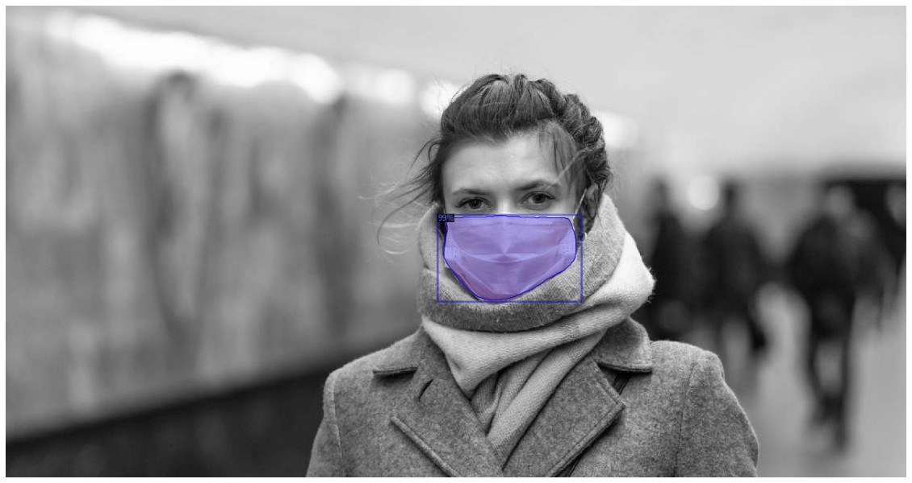
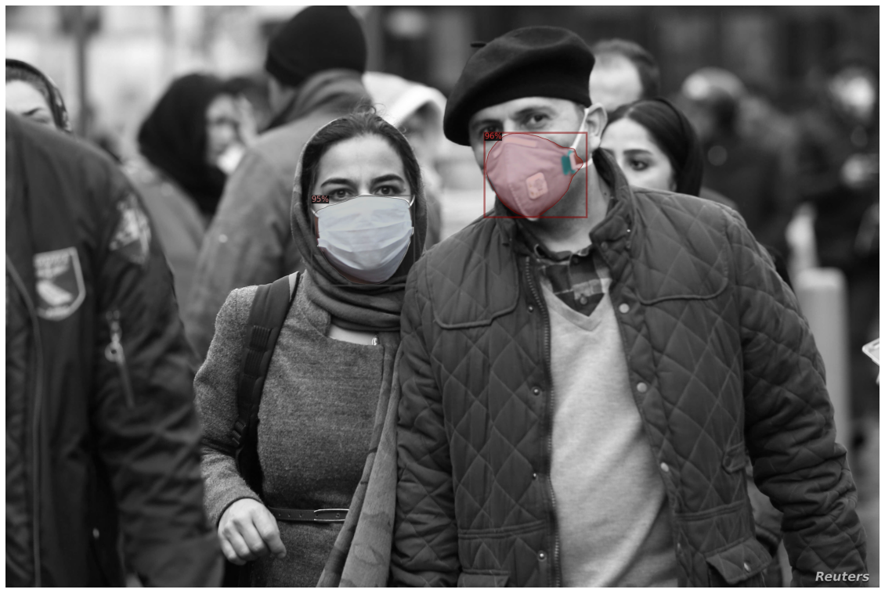

# Detectron2_facemask_detection

2020年8月15日於新北創立坊舉辦交流會

## 活動介紹
- 透過Detecron2進行口罩辨識
- 影像標記教學
- 拿標記好的檔案訓練自己的模型
- 辨識正確率為97.6%
- 包含影像識別及動態影像識別

## 使用技術
- 使用Facebook開發的Detecron2
- 利用[VGG Image Annotator(VIA)標記](http://www.robots.ox.ac.uk/~vgg/software/via/via.html)

## 結果展示
- 單個目標

- 多個目標

